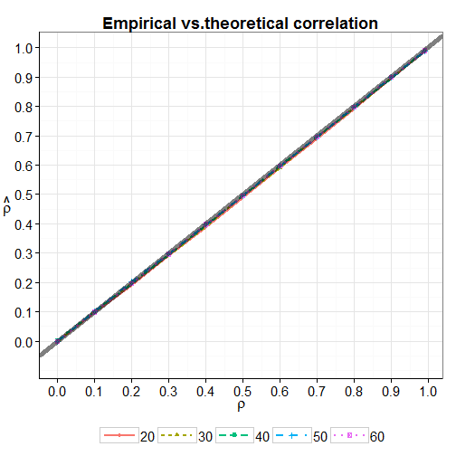
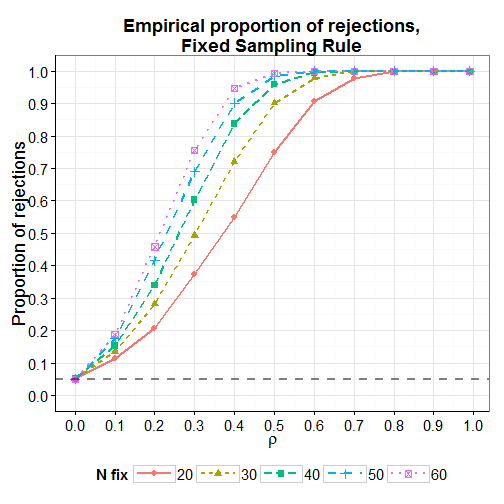

Contraste de correlaciones muestreo secuencial 
========================================================
author: Lorenzo Braschi Diaferia
date: 
transition: concave
font-family: 'Helvetica'
autosize: true

Simulación regla fija
========================================================
type: section


Regla Fija
========================================================

Estructura de la regla fija: 


```r
function(n,r){
  require(MASS)
  muestra <- mvrnorm(n, Sigma = matrix(c(1,r,r,1),2),mu = rep(0,2)) 
  out.cor <- cor(muestra[,1],muestra[,2]) 
  tstat <- out.cor*sqrt(n-2)/sqrt(1-out.cor^2)
  pvalue <- 1-pt(tstat,n-2)
  decision <- ifelse(pvalue<=.05,1,0)  
  return(c(out.cor,tstat,pvalue,decision))
}
```


Estructura de la regla fija
========================================================
- Genera una muestra aleatoria de tamaño *n* de una distribución normal multivariante con matriz de correlaciones: 

$$
  \begin{aligned}
  \Large
  \begin{pmatrix}
  1 & \rho \\
  \rho & 1
  \end{pmatrix}
  \end{aligned}
$$


```r
require(MASS)
  muestra <- mvrnorm(n, Sigma = matrix(c(1,r,r,1),2),mu = rep(0,2))
```


Estructura de la regla fija
=======================================================

- Calcula la correlación entre los dos vectores obtenidos. 


```r
out.cor <- cor(muestra[,1],muestra[,2])
```


- Realiza un contraste de hipótesis nula $H_0: \rho = 0$ mediante la transformación de Fisher. 


```r
tstat <- out.cor*sqrt(n-2)/sqrt(1-out.cor^2)
```


Estructura de la regla fija
=======================================================
- Obtiene el valor de probabilidad $p$, y acepta o rechaza la hipótesis nula con $p \le 0.05$. 


```r
pvalue <- 1-pt(tstat,n-2)
decision <- ifelse(pvalue <=.05, 1, 0) 
return(c(out.cor, tstat, pvalue, decision))
```


Condiciones de simulación
=======================================================
 
- Tamaños muestrales: 

  $N = \{20,~30,~40,~50,~60\}$

- Correlaciones poblacionales: 

  $\rho = \{0,~0.1,~0.2,~0.3 ...~0.8,~0.99\}$
  
  
Resultados de la simulación
=======================================================     


```
  corr_teo nfsr corr_emp       t pvalue
1        0   20  0.27657  1.2210 0.1189
2        0   20  0.16883  0.7267 0.2384
3        0   20 -0.05118 -0.2174 0.5848
4        0   20  0.12189  0.5210 0.3044
5        0   20 -0.08487 -0.3614 0.6390
6        0   20 -0.29079 -1.2894 0.8932
7        0   20  0.19168  0.8286 0.2091
8        0   20 -0.30732 -1.3701 0.9063
```


Cálculos
=======================================================
Se calculan: 

- La transformación de Fisher de la correlación empírica obtenida. 

$$latex
Z = 0.5 \left(  \ln \frac {1 + r} {1 - r} \right)
$$

- La varianza teórica 


Gráficos
=======================================================




Potencia
=======================================================




